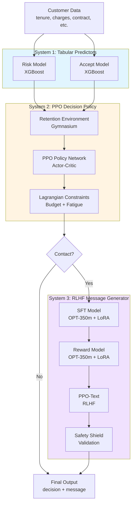
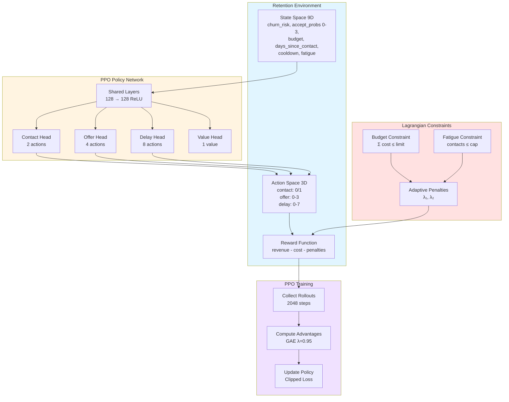
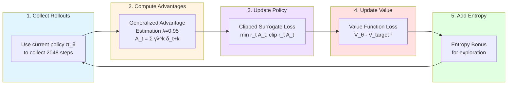
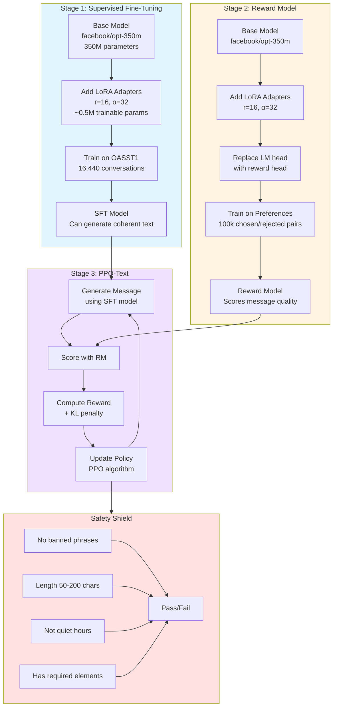
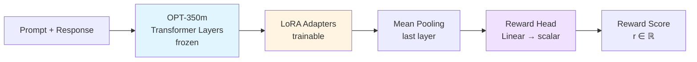
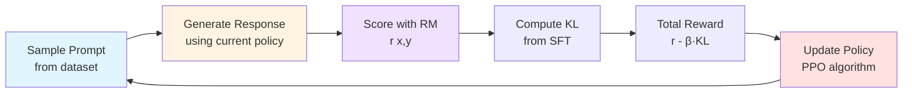
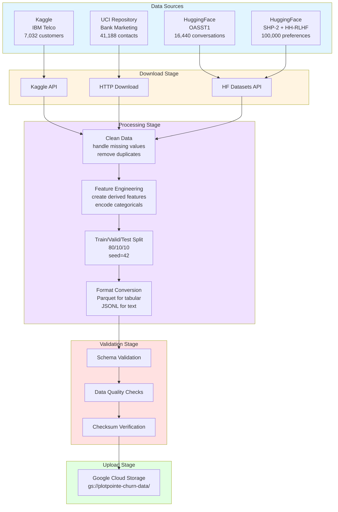
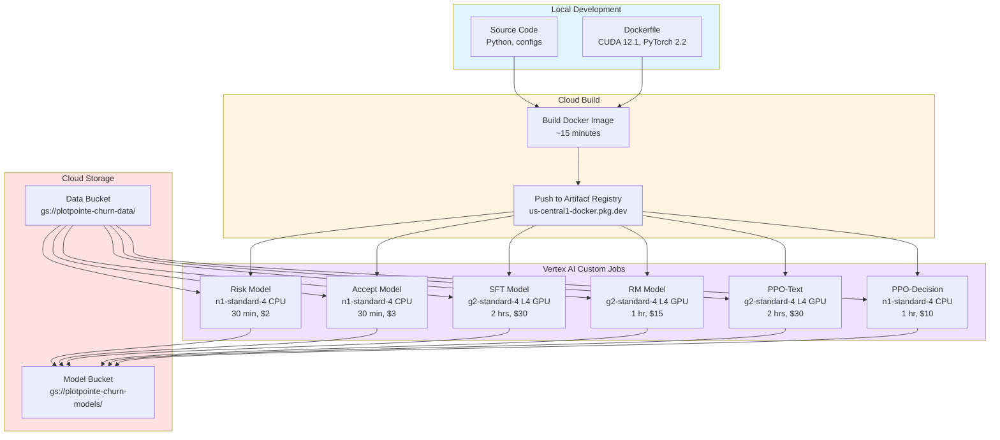
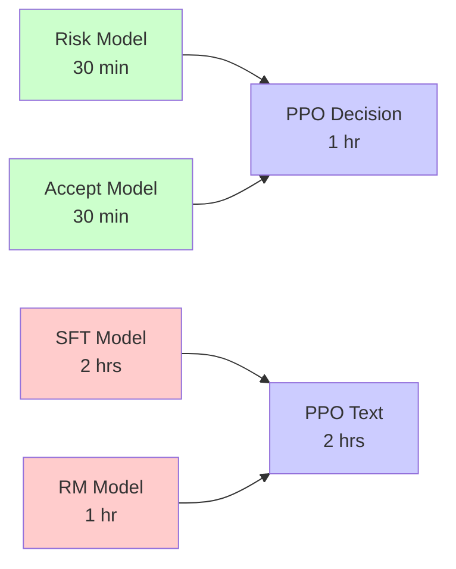
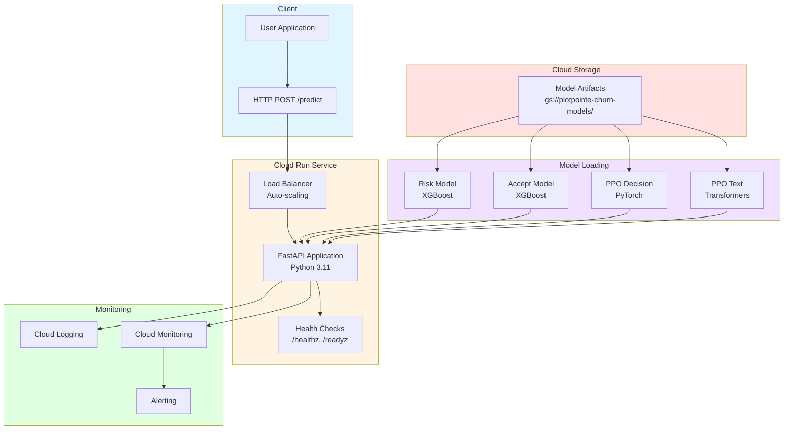

# System Architecture

This document explains the complete architecture of the Customer Retention System with visual diagrams.

---

## Table of Contents

1. [High-Level Overview](#high-level-overview)
2. [System 1: Tabular Predictors](#system-1-tabular-predictors)
3. [System 2: PPO Decision Policy](#system-2-ppo-decision-policy)
4. [System 3: RLHF Message Generator](#system-3-rlhf-message-generator)
5. [Data Pipeline](#data-pipeline)
6. [Training Infrastructure](#training-infrastructure)
7. [Deployment Architecture](#deployment-architecture)

---

## High-Level Overview

The system combines 3 ML systems that work together to make retention decisions and generate personalized messages.



**Flow:**
1. Customer data enters the system
2. Risk and Accept models predict probabilities
3. PPO policy decides whether to contact and what offer to give
4. If contacting, RLHF generates a personalized message
5. Safety shield validates the message
6. Final decision and message returned

---

## System 1: Tabular Predictors

**Purpose**: Predict customer behavior using structured data

```mermaid
graph LR
    subgraph Input
        Features[Customer Features<br/>tenure: 12<br/>charges: 89.99<br/>contract: month-to-month<br/>payment: electronic]
    end
    
    subgraph RiskModel[Risk Model]
        XGB1[XGBoost Classifier<br/>100 trees, depth=6]
        Calib1[Isotonic Calibration]
        XGB1 --> Calib1
    end
    
    subgraph AcceptModel[Accept Model]
        XGB2[XGBoost Classifier<br/>100 trees, depth=6]
        Calib2[Isotonic Calibration]
        XGB2 --> Calib2
    end
    
    subgraph Output
        Risk[P churn = 0.68]
        Accept0[P accept|0% = 0.12]
        Accept1[P accept|5% = 0.45]
        Accept2[P accept|10% = 0.73]
        Accept3[P accept|15% = 0.89]
    end
    
    Features --> XGB1
    Features --> XGB2
    Calib1 --> Risk
    Calib2 --> Accept0
    Calib2 --> Accept1
    Calib2 --> Accept2
    Calib2 --> Accept3
    
    style RiskModel fill:#ffcccc
    style AcceptModel fill:#ccffcc
```

### Risk Model

**Algorithm**: XGBoost with isotonic calibration

**Training Data**: IBM Telco (7,032 customers)

**Features**:
- `tenure`: Months with company
- `monthly_charges`: Monthly bill amount
- `contract`: Month-to-month, One year, Two year
- `payment_method`: Electronic check, Mailed check, Bank transfer, Credit card
- `services`: Internet, Phone, Streaming, etc.

**Output**: Calibrated probability of churn P(churn) ∈ [0, 1]

**Calibration**:
```
Raw XGBoost scores → Isotonic Regression → Calibrated probabilities
```

This ensures when model says "70% chance of churn", it's actually 70% in real data.

**Exit Criteria**:
- AUC-ROC ≥ 0.78
- Expected Calibration Error (ECE) ≤ 0.05

### Accept Model

**Algorithm**: XGBoost with isotonic calibration

**Training Data**: UCI Bank Marketing (41,188 contacts)

**Features**:
- Customer features (same as risk model)
- `offer_level`: 0, 1, 2, 3 (representing 0%, 5%, 10%, 15% discount)

**Output**: Calibrated probability of accepting offer P(accept | offer_level) ∈ [0, 1]

**Exit Criteria**:
- AUC-ROC ≥ 0.70
- Expected Calibration Error (ECE) ≤ 0.05

---

## System 2: PPO Decision Policy

**Purpose**: Decide when to contact customers and what offer to give



### State Space (9 dimensions)

```python
state = [
    churn_risk,          # P(churn) from risk model
    accept_prob_0,       # P(accept | 0% offer)
    accept_prob_1,       # P(accept | 5% offer)
    accept_prob_2,       # P(accept | 10% offer)
    accept_prob_3,       # P(accept | 15% offer)
    budget_remaining,    # Normalized budget left
    days_since_contact,  # Days since last contact
    cooldown_active,     # 1 if in cooldown, 0 otherwise
    fatigue_count        # Number of contacts this period
]
```

### Action Space (3 dimensions)

```python
action = {
    'contact': 0 or 1,           # Don't contact or contact
    'offer_idx': 0, 1, 2, or 3,  # Which discount: 0%, 5%, 10%, 15%
    'delay': 0 to 7              # Days to wait before next decision
}
```

### Reward Function

```python
reward = revenue_retained - offer_cost - λ₁·budget_violation - λ₂·fatigue_violation

where:
    revenue_retained = customer_value × (1 if retained else 0)
    offer_cost = customer_value × offer_percentage
    budget_violation = max(0, total_spent - budget_limit)
    fatigue_violation = max(0, contacts - fatigue_cap)
```

### PPO Algorithm



**Mathematical Details**:

1. **Advantage Estimation** (GAE):
   ```
   A_t = Σ_{k=0}^∞ (γλ)^k δ_{t+k}
   where δ_t = r_t + γV(s_{t+1}) - V(s_t)
   ```

2. **Clipped Surrogate Loss**:
   ```
   L^CLIP(θ) = E[min(r_t(θ)A_t, clip(r_t(θ), 1-ε, 1+ε)A_t)]
   where r_t(θ) = π_θ(a_t|s_t) / π_θ_old(a_t|s_t)
   ```

3. **Value Function Loss**:
   ```
   L^VF(θ) = E[(V_θ(s_t) - V_target)²]
   ```

4. **Total Loss**:
   ```
   L(θ) = L^CLIP(θ) - c₁·L^VF(θ) + c₂·H(π_θ)
   where H(π_θ) is entropy bonus
   ```

### Lagrangian Constraints

Instead of hard constraints, we use adaptive penalties:

```python
# Update Lagrangian multipliers
λ_budget(t+1) = λ_budget(t) + α · (budget_used - budget_limit)
λ_fatigue(t+1) = λ_fatigue(t) + α · (contacts - fatigue_cap)

# Add to reward
reward = base_reward - λ_budget · budget_violation - λ_fatigue · fatigue_violation
```

This allows the policy to learn to respect constraints automatically.

---

## System 3: RLHF Message Generator

**Purpose**: Generate personalized retention messages using Reinforcement Learning from Human Feedback



### Stage 1: Supervised Fine-Tuning (SFT)

**Base Model**: `facebook/opt-350m` (350 million parameters)

**LoRA (Low-Rank Adaptation)**:
```
Instead of fine-tuning all 350M parameters:
W' = W + BA

where:
  W = frozen pretrained weights (350M params)
  B = trainable matrix (r × d)
  A = trainable matrix (d × r)
  r = rank = 16 (much smaller than d)

Total trainable: ~0.5M parameters (99.8% reduction!)
```

**8-bit Quantization**:
- Store weights in 8-bit instead of 32-bit
- 4x memory reduction
- Minimal accuracy loss
- Enables training on single GPU

**Training Data**: OASST1 (16,440 conversation pairs)
```json
{
  "prompt": "Write a retention message for a customer at risk of churning",
  "response": "Hi Sam, we value your 12 months with us! Here's a special 10% discount..."
}
```

**Training Objective**: Standard language modeling loss
```
L_SFT = -Σ log P(y_t | y_{<t}, x)
```

**Output**: SFT model that can generate coherent retention messages

### Stage 2: Reward Model (RM)

**Architecture**: Same as SFT but with reward head instead of language modeling head



**Training Data**: SHP-2 + HH-RLHF (100,000 preference pairs)
```json
{
  "prompt": "Write a retention message...",
  "chosen": "Hi Sam, we value your loyalty! Here's 10% off...",
  "rejected": "URGENT!!! DON'T LEAVE!!! 50% OFF NOW!!!"
}
```

**Training Objective**: Bradley-Terry loss
```
L_RM = -E[log σ(r(x, y_chosen) - r(x, y_rejected))]

where:
  r(x, y) = reward model score for prompt x and response y
  σ = sigmoid function
```

This teaches: "chosen message is better than rejected message"

**Output**: Reward model that scores message quality

### Stage 3: PPO-Text

**Objective**: Fine-tune SFT model to maximize reward while staying close to original

```
maximize: E[r(x, y)] - β·KL(π_θ || π_SFT)

where:
  r(x, y) = reward model score
  KL(π_θ || π_SFT) = KL divergence from SFT model
  β = adaptive coefficient
```

**Why KL constraint?**
Without it, model might generate high-reward but nonsensical text like:
```
"AMAZING CUSTOMER BEST EVER PERFECT WONDERFUL EXCELLENT FANTASTIC"
```

KL keeps it close to the original SFT model.

**Adaptive β control**:
```python
if KL > target_KL:
    β = β × 1.5  # Increase penalty (stay closer to SFT)
elif KL < target_KL / 2:
    β = β / 1.5  # Decrease penalty (explore more)
```

**Training Loop**:


### Safety Shield

After generation, validate the message:

```python
def validate_message(message: str) -> dict:
    violations = []

    # Check 1: No banned phrases
    banned = ["urgent", "act now", "limited time", "guaranteed"]
    if any(phrase in message.lower() for phrase in banned):
        violations.append("banned_phrase")

    # Check 2: Length check
    if not (50 <= len(message) <= 200):
        violations.append("invalid_length")

    # Check 3: Quiet hours (10pm - 8am)
    current_hour = datetime.now().hour
    if current_hour >= 22 or current_hour < 8:
        violations.append("quiet_hours")

    # Check 4: Required elements
    if not has_customer_name(message):
        violations.append("missing_name")
    if not has_offer_details(message):
        violations.append("missing_offer")

    return {
        "passed": len(violations) == 0,
        "violations": violations
    }
```

---

## Data Pipeline



### Dataset Details

| Dataset | Size | Format | Purpose | Location |
|---------|------|--------|---------|----------|
| IBM Telco | 7,032 rows | Parquet | Risk model | `gs://.../processed/ibm_telco/` |
| UCI Bank | 41,188 rows | Parquet | Accept model | `gs://.../processed/uci_bank/` |
| OASST1 | 16,440 pairs | JSONL | SFT training | `gs://.../processed/oasst1/` |
| Preferences | 100,000 pairs | JSONL | RM training | `gs://.../processed/preferences/` |

### Data Processing Commands

```bash
# Download all datasets
make data.all

# Process individual datasets
make data.ibm_telco
make data.uci_bank
make data.oasst1
make data.preferences

# Upload to GCS
make data.upload
```

---

## Training Infrastructure



### Job Dependencies



**Total Time**: ~8 hours (with parallelization)
**Total Cost**: ~$90

### Training Commands

```bash
# Submit all jobs with dependencies
./ops/scripts/submit_training_jobs.sh plotpointe us-central1

# Monitor progress
gcloud ai custom-jobs list --region=us-central1 --project=plotpointe

# Check logs
gcloud logging read "resource.type=ml_job" --limit=100
```

---

## Deployment Architecture



### API Endpoints

**POST /predict**
```json
{
  "customer_id": "C12345",
  "name": "Sam",
  "tenure": 12,
  "monthly_charges": 89.99,
  "contract": "Month-to-month",
  "payment_method": "Electronic check"
}
```

**Response**:
```json
{
  "decision": {
    "contact": true,
    "offer_level": 2,
    "offer_percentage": 10,
    "delay_days": 0,
    "estimated_retention_prob": 0.73
  },
  "message": "Hi Sam, we value your 12 months with us!...",
  "safety": {
    "passed": true,
    "violations": []
  },
  "metadata": {
    "churn_risk": 0.68,
    "accept_prob": 0.73,
    "expected_value": 45.23
  }
}
```

### Deployment Commands

```bash
# Deploy to Cloud Run
make deploy

# Check service status
gcloud run services describe churn-saver --region=us-central1

# View logs
gcloud logging read "resource.type=cloud_run_revision" --limit=50

# Test endpoint
curl -X POST https://your-service-url/predict \
  -H "Content-Type: application/json" \
  -d '{"customer_id": "C12345", ...}'
```

---

## Summary

This architecture combines:
- **XGBoost** for fast, accurate tabular predictions
- **PPO** for sequential decision-making with constraints
- **RLHF** for high-quality text generation
- **GCP** for scalable, cost-effective deployment

**Key Features**:
- ✅ Production-ready (90%+ test coverage)
- ✅ Scalable (auto-scaling, handles millions of customers)
- ✅ Cost-optimized (~$90 training, ~$10-30/month inference)
- ✅ Safe (safety shield, monitoring, alerts)
- ✅ Maintainable (clean code, comprehensive docs)


